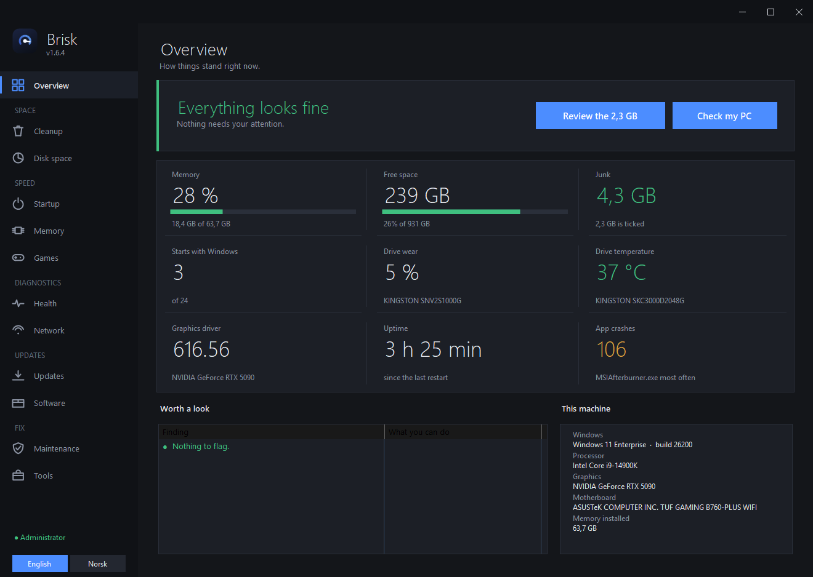
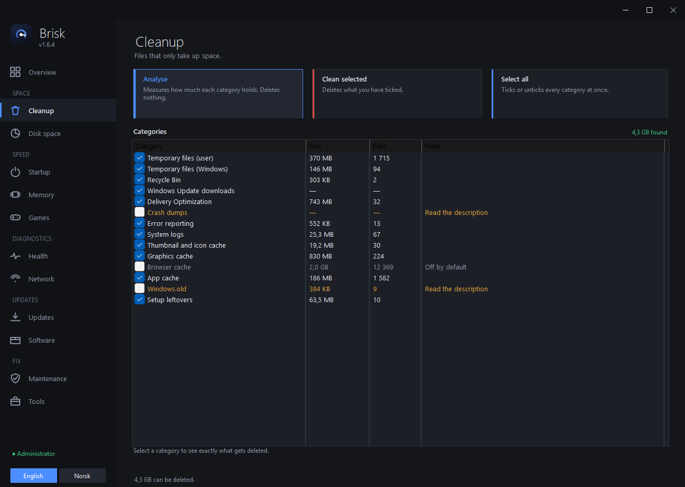
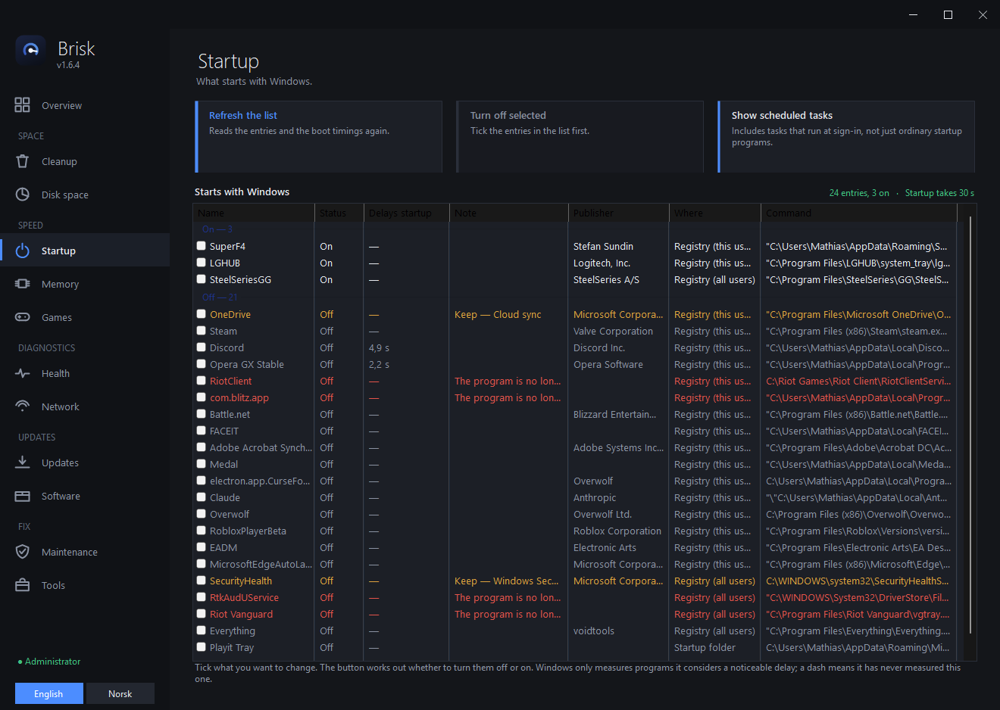
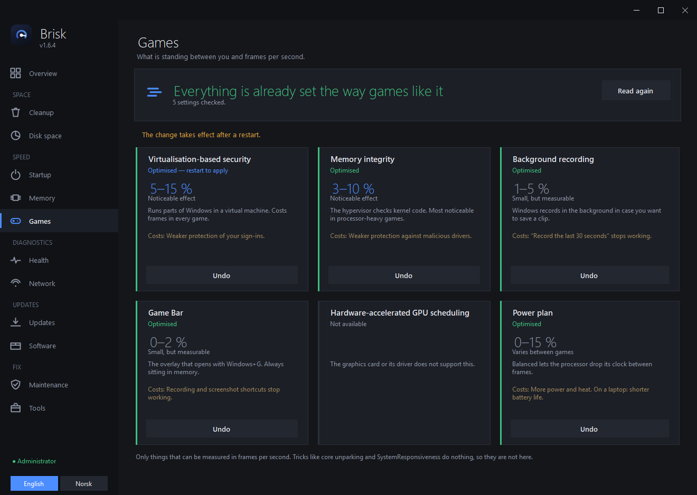
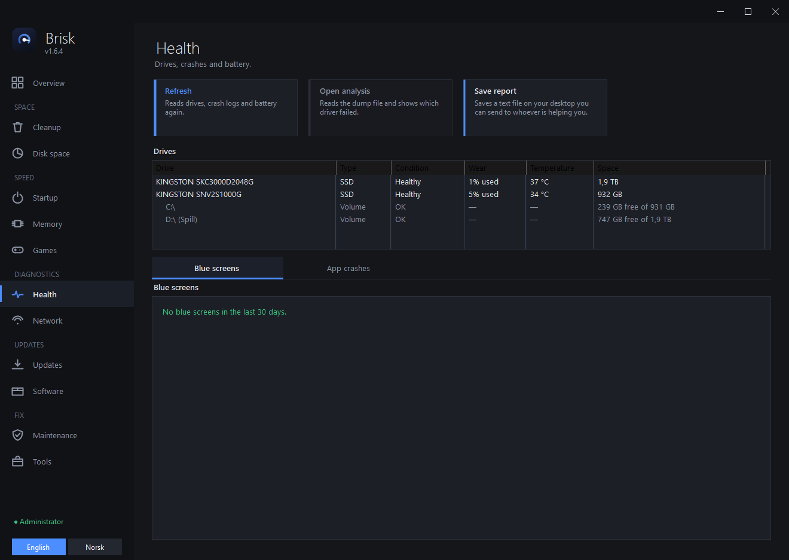

# Brisk

Windows maintenance that does what it says. Free, no subscription, no telemetry.

One executable under half a megabyte. Nothing to install first: it runs on the
.NET Framework 4.8 that already ships with Windows 10 and 11.

English by default. Norwegian is one click away, bottom left.

[](https://www.buymeacoffee.com/mattern)

---

## Getting it

Download **`BriskInstaller.exe`** from
[Releases](https://github.com/MatternPL/Brisk/releases/latest).

* Installs to `%LOCALAPPDATA%\Programs\Brisk`, with no UAC prompt
* Start menu shortcut, optional desktop shortcut
* Shows up in Apps & features and uninstalls from there

Releases also carry **`Brisk.exe`** on its own, for anyone who would rather not
run an installer. It needs nothing installed, writes nothing outside its own
folder and `%LOCALAPPDATA%\Brisk`, and works from a USB stick.

From 1.7.0 the files are code-signed, so Windows names the publisher instead of
saying *Unknown publisher*. SmartScreen can still warn on the first downloads —
reputation is earned per certificate over time, not granted on the day it is
issued. See [Is it safe?](#is-it-safe) for how to check the signature yourself.

---

## What it looks like



The front page measures the machine while Brisk starts, so the numbers are
there the moment the window opens.

| | |
|---|---|
|  |  |
| **Cleanup.** Measure first, delete second. Crash dumps, browser cache and Windows.old are unticked, and stay unticked. | **Startup.** Split into what is on and what is off, with the seconds each one adds to boot, read from Windows' own measurements. |
|  |  |
| **Games.** Each setting says whether it is optimised, roughly what it gains, and what it costs you. | **Health.** Drive wear and temperature, battery, blue screens and app crashes. |

---

## What it does

Brisk measures the machine while it starts, so the front page has real numbers
the moment it opens: memory, free space, junk files, start-up programs, drive
wear and temperature, graphics driver, uptime, and crashes. Above them is a
verdict — *Everything looks fine*, or a list of what is worth a look.
Double-click a row to go there.

| Page | |
|---|---|
| **Cleanup** | Temp files, Windows Update leftovers, crash dumps, browser and shader caches, system logs. Browser cache, crash dumps and Windows.old are unticked by default. |
| **Disk space** | Four modes. *Largest* shows where the space sits. *Duplicates* finds identical files by content. *Forgotten files* lists big files you haven't touched in six months. *Space Windows reserves* shows the hibernation file, restore points and page file, usually tens of GB that no cleaner touches. |
| **Startup** | Everything that starts with Windows, with how many seconds each one adds to boot. Read from Windows' own measurements, not guesswork. |
| **Memory** | What is actually using RAM, and an honest note about why "RAM boosters" don't help. |
| **Games** | Settings that measurably affect frame rate: virtualisation-based security, memory integrity, Game DVR, Game Bar, hardware-accelerated GPU scheduling and the power plan. Each one says what it costs you and roughly what it gains, and whether it needs a restart. |
| **Health** | Drive wear and temperature, battery capacity on laptops, a blue screen analyser that reads the crash dump and names the driver that failed, and app crashes: which programs crash, how often, and which module faulted. |
| **Network** | Adapter, gateway, internet, DNS, Wi-Fi signal, and a check of the hosts file and proxy, the two things malware likes to hijack. |
| **Updates** | Drivers and Windows updates from Microsoft's own catalog through the Windows Update API. Also checks your graphics driver against NVIDIA or AMD directly and can download a newer one, because Windows Update is always behind on those. |
| **Software** | winget updates, plus every installed program sorted by size, with uninstall. |
| **Maintenance** | sfc, DISM, TRIM, restore point, system report, weekly scheduled cleanup. |
| **Tools** | Well-known free tools by other people, installed and opened in one click: WinUtil, PowerToys, Process Explorer, Autoruns, CrystalDiskInfo, HWiNFO, O&O ShutUp10++, Everything, Rufus, 7-Zip, CPU-Z. The command is shown before it runs, output appears on the page, and a Stop button ends it. |

Adding your own tool takes one block in one file: see
[docs/verktoy.md](docs/verktoy.md).

### What it does not do

* **No registry cleaning.** It has never produced a measurable speedup.
* **No third-party driver scraping.** Windows drivers come from Microsoft,
  signed. Graphics drivers come from NVIDIA or AMD over https, from their own
  domains, and Brisk checks the address before downloading anything.
* **No CPU temperature.** That needs a kernel driver.
* **No RAM "booster" claims.** Windows uses free RAM as cache on purpose. The
  two buttons under Memory do something real but rarely help, and the app says
  so. Fewer startup programs is the fix that lasts.

### Graphics drivers

Updates shows the driver version the way NVIDIA and AMD write it themselves,
not Windows' internal number, and can look up whether something newer exists.

NVIDIA is asked through their own driver search. The series, product and OS ids
are looked up at the time of the check rather than kept as a table in the code,
so it also works for cards released after any given build of Brisk. AMD is read
from the version in the Adrenalin installer link on their download page.

A newer driver is downloaded to your Downloads folder, only over https and only
from the manufacturer's own domain. Brisk does not run it: a driver install
blanks the screen, and that is yours to start when you are ready.

### Reading a blue screen

Double-click a crash under Health and Brisk parses the kernel dump Windows wrote
(`PAGEDU64`), pulls out the stop code, the loaded module list and the call stack,
and maps the fault address to a module. It then names the driver that most likely
caused it, where each driver came from, and what to do about it. A *Copy summary*
button gives you something to paste when you need to ask someone else.

The parsing is self-checking: the stop code and its four parameters must match
what Windows logged, and module 0 must be `ntoskrnl.exe`. If either fails, it
says it could not read the dump rather than guessing.

Crash dumps are therefore excluded from the automatic cleanup and unticked by
default, since deleting them throws away the evidence. Brisk reads the real dump
path from the registry rather than assuming the default, because Windows does not
always use it.

The crash count comes from the dumps, not from the event log. If there is no dump
to read, Brisk says nothing about blue screens rather than reporting a number it
cannot explain.

### Safety

* Cleanup has a hard-coded list of folders that can never be touched: your user
  folder, Documents, Desktop, Pictures, Windows, Program Files and the drive root.
* Files in use are skipped and counted, not forced.
* Windows.old, crash dumps and browser cache are unticked by default and are
  never part of the automatic weekly cleanup.
* Browser cleanup removes cached pages and images only. History, passwords,
  bookmarks, logins and autofill live in other files and are never touched.
* Startup entries that matter (audio, touchpad, antivirus, password manager) are
  flagged amber and warn before being disabled.
* Duplicates and forgotten files are listed, never deleted for you.
* Everything lands in `%LOCALAPPDATA%\Brisk\brisk.log`.

---

## Is it safe?

A cleanup tool asks for a lot of trust: it wants administrator and it deletes
files. "Trust me" is not an answer, so here is what you can check for yourself.

**Check the signature.** Right-click the file → Properties → **Digital
Signatures**. It should say:

> **Open Source Developer Mathias Arne Andresen**, issued by Certum Code
> Signing 2021 CA, SHA-256, countersigned by Certum Timestamping.

If that tab is missing, or the name is anything else, you did not get the file
from here. The signature covers every byte, so it also proves nothing was
changed on the way to you — which a checksum published on the same page as the
download cannot do on its own.

**Read it.** Every line that ships is in this repository, MIT licensed. There
is no build server and no minified anything — what you see is what runs.

**Build it.** `bygg.cmd` uses the C# compiler that already ships with Windows.
No SDK, no NuGet, nothing downloaded. If you would rather run your own copy
than mine, you can have one in about ten seconds.

One honest limitation: the build is **not** byte-for-byte reproducible, so your
`Brisk.exe` will not have the same checksum as the released one. Comparing
hashes will not prove anything. Reading the source and building your own copy
will.

**Scan it.** Every release publishes the sha256 of its installer in
[`oppdatering.json`](oppdatering.json). Brisk checks that hash before it runs
anything it downloads, and from 1.7.1 it also requires the file to be signed
by the name above — a checksum published next to the download cannot prove much
on its own, but a signature can. You can paste the same hash into VirusTotal to
see what the engines say about the exact file you got:

> **1.7.1 · BriskInstaller.exe**
> `37668a0aa51cf077e140741865c614757783732fc1e169b92991f02cd13a6e06`
> · [look it up](https://www.virustotal.com/gui/file/37668a0aa51cf077e140741865c614757783732fc1e169b92991f02cd13a6e06)
>
> **1.7.1 · Brisk.exe**
> `4639b287ce7725129ef445b517fd21e398ad3348566ec717e3779410d8598d48`
> · [look it up](https://www.virustotal.com/gui/file/4639b287ce7725129ef445b517fd21e398ad3348566ec717e3779410d8598d48)

### If an antivirus flags it

A generic engine or two may still flag the installer with a machine-learning
name — something like `Trojan.MSIL.InfoStealer.gen.B` or
`MachineLearning/Anomalous`. That deserves an explanation rather than a shrug,
because "it's a false positive" is also what someone shipping malware would say.

Look at what the label actually claims. A name ending in `.gen` or `!ml`, or a
family label like `anomalous`, means the engine matched a statistical pattern —
not that it recognised code. When an engine identifies real malware, it names
the family. The pattern being matched here is a small, self-extracting
installer with few downloads that writes a program to disk and adds a registry
entry so it appears in Apps & features. Real installers do exactly that; so do
droppers, and a model that has never seen this file cannot tell them apart.

The link above shows the current picture for the exact file you downloaded,
which is more use than any number written here would be — it changes as engines
update their models and as more people download the same file.

What you can do instead of taking anyone's word:

* **Check the signature** — see above. It is the one check that identifies who
  built the file rather than guessing at what it resembles.
* **Build it yourself** — `bygg.cmd`, no SDK, ten seconds. Then no installer is
  involved at all.
* **Read the diff** — every release links to the commits that went into it.

False positives are reported to the vendors as they turn up.

**Why SmartScreen may still warn.** Not because anything was detected. Windows
warns about programs it has not seen enough of yet, and that reputation is
earned per certificate over downloads and time — signing starts the clock, it
does not skip it. What changed with 1.7.0 is that the reputation now
accumulates at all: an unsigned file is judged by its hash, and every release
has a new one, so each release used to start from nothing.

### What it sends, and where

Nothing is uploaded, ever. There is no account, no analytics, no crash
reporting, no ads. These are every address Brisk can reach, and when:

| Where | When | What for |
|---|---|---|
| `raw.githubusercontent.com` | At every start | Reads one small version file |
| `github.com` | Only if you accept an update | Downloads the installer, checked against its sha256 |
| `nvidia.com`, `geforce.com` | Only when you press *Check for a new driver* | Looks up the newest driver for your card |
| `amd.com`, `drivers.amd.com` | Same | Same |
| Whatever `winget` uses | Only when you install something from Software or Tools | Microsoft's own package manager does the work |
| A tool's own website | Only when you click its name | Opens your browser, nothing more |

The one exception worth naming: **WinUtil** on the Tools page runs
`irm https://christitus.com/win | iex`, which downloads and runs someone else's
PowerShell script. That is how its author distributes it. Brisk shows you the
command before it runs and does not hide what it is, but it is other people's
code from another domain — treat it as such.

### What needs administrator, and why

Brisk starts without it and most of the program works. These need it, and they
say so before they run:

* Cleaning Windows' own folders (Update leftovers, system logs, Windows.old)
* `sfc`, `DISM`, TRIM, restore points, the scheduled cleanup
* Startup entries that belong to all users, not just you
* Installing Windows updates and drivers
* Virtualisation-based security, memory integrity and the power plan under Games

Everything it does lands in `%LOCALAPPDATA%\Brisk\brisk.log` with timestamps,
including the failures.

---

## Updating itself

Brisk looks for a new version each time it starts, on a background thread. If
there is one you get a dialog with the release notes and two buttons. Nothing is
downloaded or installed unless you say yes. *Check for update* under Maintenance
does the same thing on demand.

Both the version file and the download must be `https`, and the download is
verified against a sha256 from the version file **before** it is executed. A
mismatch means the file is deleted and nothing runs.

To turn the automatic check off, set `SjekkAutomatisk` to `0` under
`HKCU\Software\Brisk`. The manifest address can be overridden the same way with
`OppdateringsUrl`.

---

## Command line

| | |
|---|---|
| `Brisk.exe /auto` | Runs the safe cleanup with no window. Used by the scheduled task. |
| `Brisk.exe /side:helse` | Opens a page directly: `oversikt`, `rydding`, `diskplass`, `oppstart`, `minne`, `spill`, `helse`, `nettverk`, `drivere`, `programmer`, `vedlikehold`, `verktoy`, `logg`. |
| `BriskInstaller.exe /S` | Silent install. Add `/start` to launch afterwards. |
| `Uninstall.exe /uninstall` | Uninstall. Add `/S` for silent. |

---

## Building

```
bygg.cmd
```

No Visual Studio, no NuGet, no SDK. It uses the C# compiler already sitting in
`C:\Windows\Microsoft.NET\Framework64\v4.0.30319`. That compiler only supports
C# 5, so no string interpolation, no `?.`, no `nameof`.

```
src/
  Program.cs          entry point, arguments, error handling
  SplashForm.cs       the start-up measurement and its window
  MainForm*.cs        window and pages
  Chrome.cs           the title bar, window dragging and resizing
  Theme.cs Widgets.cs dark theme, cards, buttons, lists
  Logo.cs Icons.cs    the mark and the sidebar glyphs
  Lang.cs             English/Norwegian, Norwegian text is the key
  Cleaner.cs          cleanup engine and the do-not-touch list
  SpaceTools.cs       hibernation file, restore points, page file
  StartupTools.cs     startup entries and scheduled tasks
  BootTools.cs        boot time and what delays it, from the event log
  GameTools.cs        the settings on the Games page
  HealthTools.cs      drive wear, battery, crash events
  NvmeTools.cs        SMART data read from NVMe drives directly
  DumpTools.cs        kernel crash dump parser
  CrashDialog.cs      the blue screen analysis window
  AppCrashTools.cs    app crashes from the event log
  NetTools.cs         connectivity, hosts file, proxy
  GpuTools.cs         graphics driver version and the NVIDIA/AMD lookup
  DriverTools.cs      drivers via Windows Update
  SystemTools.cs      memory, winget, disk health, maintenance
  MachineInfo.cs      what kind of machine this is
  ExternalTools.cs    the list behind the Tools page
  Extras.cs           Windows updates, disk usage, duplicates, uninstall, report
  Updater.cs UpdateDialog.cs   self-update
  Native.cs Util.cs   P/Invoke and shared helpers
installer/            the installer
tools/                build helpers and self-tests
docs/                 guides and release notes
```

`tools/SelfTest.cs` walks memory, cleanup (measure only), startup, disks, problem
devices and winget, and prints real numbers. `tools/sprak_sjekk.py` checks that
every `L.T()` key in the source has an English translation.

Releasing is documented in [docs/utgivelser.md](docs/utgivelser.md).

## Supporting it

Brisk is free and stays free. If it saved you some time, you can
[buy me a beer](https://www.buymeacoffee.com/mattern).

The first thing it paid for is done: Brisk has been signed since 1.7.0, so
Windows names the publisher instead of warning about an unknown one. The
certificate renews every year, and that is what the beer money covers now.

---

## Licence

MIT.
